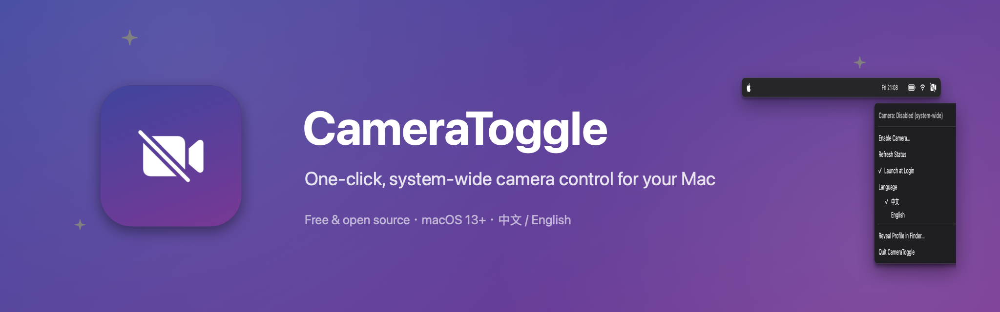
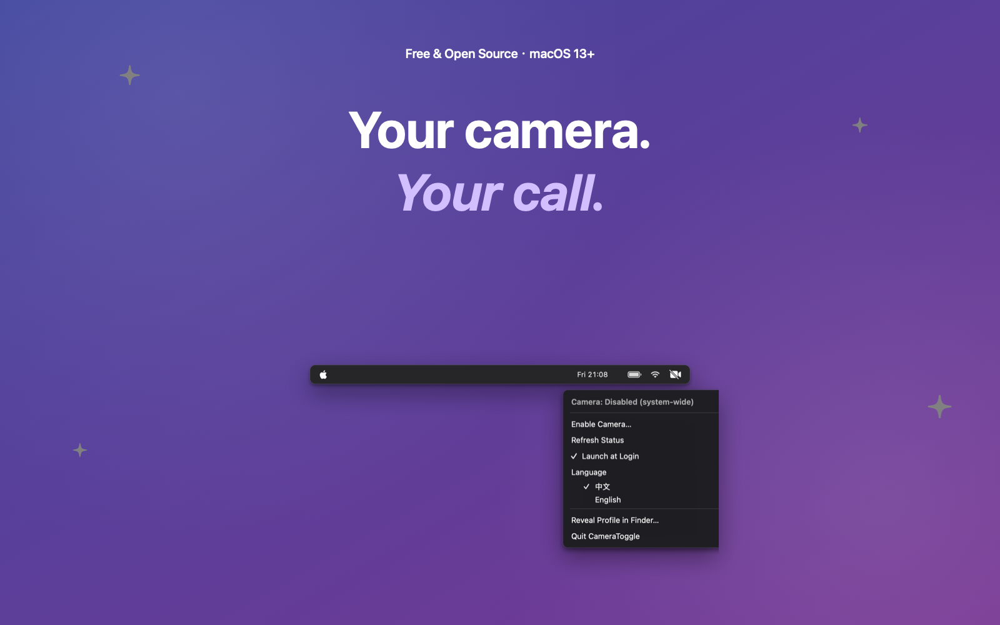

<div align="center">



**[English](README.md)** | [简体中文](README.zh-CN.md)

**CameraToggle** — one-click, system-wide camera control for your Mac.

Turn the camera off for *every* app from the menu bar. Turn it back on just as fast — no password, no reboot.

</div>

---

## Why

Webcams get hijacked. Tape works, but it's ugly and permanent. CameraToggle flips a **system-level switch** instead: when disabled, FaceTime, Zoom, Chrome, OBS — every app — sees no camera at all. It's the software equivalent of unplugging it.



## Features

- 🚫 **System-wide off** — a configuration-profile restriction (`allowCamera = false`) disables built-in *and* external cameras for all apps
- ⚡ **One-click on** — re-enabling is a single menu click, no password prompt
- 🧭 **Guided setup** — on macOS 26 the OS requires one manual confirm; a built-in guide window walks you through it (auto-closes when done)
- 🌏 **Bilingual** — 中文 / English UI, follows your system language, switchable any time
- 🚀 **Launch at login** — official `SMAppService` toggle in the menu
- 👀 **Live status icon** — the menu bar icon shows at a glance whether the camera is enabled
- 🔓 **Open source, single file of Swift** — no daemon, no background process, no telemetry

## How it works

CameraToggle installs/removes a signed-off configuration profile containing a `com.apple.applicationaccess` restriction with `allowCamera = false` — the same mechanism MDM solutions use, done locally.

- **Disable**: stages the profile and opens *System Settings → Profiles* (macOS 26 removed the `profiles install` CLI, so the OS requires one manual confirm). On macOS 15 and earlier it's fully automatic after a password prompt.
- **Enable**: removes the profile — user-installed profiles can be removed by the current user directly, no password needed.
- It only ever touches its own profile identifier (`local.cameratoggle.off`), never `-all`, so MDM/work profiles are safe.

## Download & install

**Homebrew (easiest):**

```bash
brew install jdomzhang/tap/cameratoggle
```

**Manual:** grab the **`.dmg` installer** (or `.zip`) from [Releases](https://github.com/jdomzhang/CameraToggle/releases), open it, and drag **CameraToggle** to `/Applications`. Universal binary — Apple Silicon and Intel, macOS 13+. Official releases are **Developer ID signed & notarized** (forks/self-builds are unsigned).

Building it yourself (~10 seconds, fully verifiable): see below. Self-built binaries are unsigned, so Gatekeeper may complain on first launch — right-click the app → **Open** → Open.

## Build & run

Requires Xcode Command Line Tools (`xcode-select --install`), macOS 13+.

```bash
git clone https://github.com/jdomzhang/CameraToggle.git
cd CameraToggle
./build.sh          # → CameraToggle.app
open CameraToggle.app
```

Prefer a stable home before enabling *Launch at Login*: `mv CameraToggle.app /Applications/`.

## Usage

1. Click the 🎥 icon in the menu bar.
2. **Disable Camera…** → confirm in System Settings (guided, ~15 s) → the icon turns to 🚫.
3. **Enable Camera…** → done, instantly.

Other menu items: refresh status, launch at login, language switch, reveal the profile in Finder, quit.

Diagnostics live in `~/.camera-toggle/debug.log`; the profile itself is at `~/.camera-toggle/camera-off.mobileconfig`.

## FAQ

**Why can't this be on the App Store?**
App Store apps must be sandboxed, and sandboxing forbids everything this app does (profile installation, privileged commands). Distribute via Developer ID + notarization or build from source.

**Is the camera really off?**
Yes — the restriction is enforced by the OS at the driver-access level. Apps that try get an error, not a black feed.

**How do I uninstall?**
Enable the camera first (or delete the profile in System Settings), then delete the app and `~/.camera-toggle/`.

## License

Released under the [MIT License](LICENSE). © 2026 Edesoft Intelligence Technology Co., Ltd.

## Credits

Marketing images generated with [ParthJadhav/app-store-screenshots](https://github.com/ParthJadhav/app-store-screenshots) design principles (rendered with CoreGraphics, see `shotgen.swift`).
