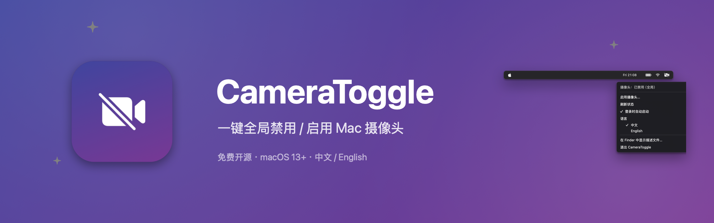
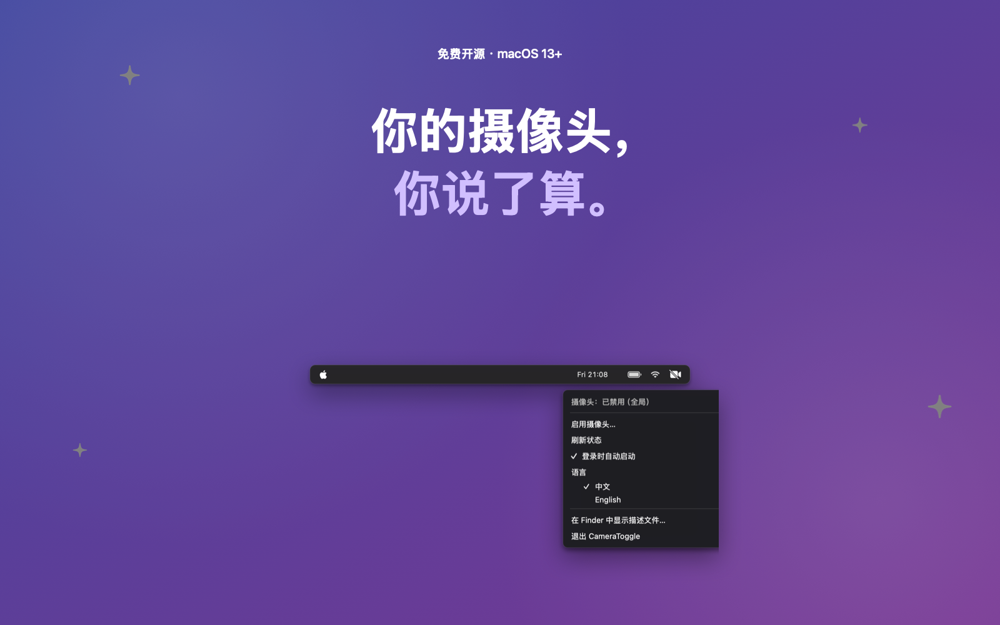

<div align="center">



[English](README.md) | **[简体中文](README.zh-CN.md)**

**CameraToggle** —— 一键全局禁用 / 启用 Mac 摄像头。

从菜单栏一键关闭*所有* App 的摄像头，也能同样快地恢复——无需密码、无需重启。

</div>

---

## 为什么需要它

摄像头会被劫持。贴胶带有效，但难看且永久。CameraToggle 翻转的是**系统级开关**：禁用后，FaceTime、Zoom、Chrome、OBS——所有 App 都看不到摄像头，相当于把它"拔掉了"。



## 功能

- 🚫 **全局禁用** —— 通过配置描述文件限制（`allowCamera = false`），内置和外接摄像头对所有 App 同时失效
- ⚡ **一键恢复** —— 点一下菜单即可启用，无需密码
- 🧭 **引导式设置** —— macOS 26 要求手动确认一次，内置引导窗口带你走完流程（完成自动关闭）
- 🌏 **中英双语** —— 跟随系统语言，可随时切换
- 🚀 **开机自启** —— 菜单内开关，使用系统官方 `SMAppService`
- 👀 **状态图标** —— 菜单栏图标一眼看出摄像头当前状态
- 🔓 **开源、单文件 Swift** —— 无守护进程、无后台进程、无遥测

## 工作原理

通过安装/移除一个包含 `allowCamera = false` 限制（`com.apple.applicationaccess`）的配置描述文件实现——和 MDM 企业管理用的是同一机制，只是完全在本地完成。

- **禁用**：生成描述文件并打开 *系统设置 → 描述文件*（macOS 26 移除了 `profiles install` 命令，系统要求手动确认一次）；macOS 15 及更早版本输一次密码即全自动完成
- **启用**：移除描述文件——用户手动安装的描述文件本人即可删除，无需密码
- 只操作自己的描述文件标识符（`local.cameratoggle.off`），绝不用 `-all`，不影响公司 MDM 等其他描述文件

## 下载与安装

**Homebrew（最简单）：**

```bash
brew install jdomzhang/tap/cameratoggle
```

**手动安装：**在 [Releases](https://github.com/jdomzhang/CameraToggle/releases) 下载 **`.dmg` 安装包**（或 `.zip`），打开后把 **CameraToggle** 拖入 `Applications` 文件夹即可。通用二进制，Apple Silicon 和 Intel 芯片均可运行，macOS 13 及以上。官方 Release 为 **Developer ID 签名 + 公证**版本（fork 或自行构建则为未签名版）。

也可自行编译（约 10 秒，完全可验证），见下。自行构建的二进制未签名，首次打开如被 Gatekeeper 拦截：右键 App → **打开** → 打开。

## 构建与运行

需要 Xcode 命令行工具（`xcode-select --install`），macOS 13 及以上。

```bash
git clone https://github.com/jdomzhang/CameraToggle.git
cd CameraToggle
./build.sh          # → CameraToggle.app
open CameraToggle.app
```

开启"登录时自动启动"前建议先固定 App 位置：`mv CameraToggle.app /Applications/`。

## 使用

1. 点击菜单栏 🎥 图标
2. **禁用摄像头…** → 在系统设置中确认（有引导，约 15 秒）→ 图标变为 🚫
3. **启用摄像头…** → 立即恢复

其他菜单项：刷新状态、登录自启、语言切换、在 Finder 显示描述文件、退出。

诊断日志：`~/.camera-toggle/debug.log`；描述文件：`~/.camera-toggle/camera-off.mobileconfig`。

## 常见问题

**为什么不上架 App Store？**
App Store 强制沙箱，而沙箱禁止本 App 的一切核心操作（安装描述文件、提权命令）。建议通过 Developer ID 签名 + 公证分发，或直接源码编译。

**摄像头真的关了吗？**
是的——限制由系统在驱动访问层强制执行，App 尝试用摄像头会直接报错，而不是黑屏。

**如何卸载？**
先启用摄像头（或在系统设置中删除描述文件），再删除 App 和 `~/.camera-toggle/` 目录。

## 致谢

营销图基于 [ParthJadhav/app-store-screenshots](https://github.com/ParthJadhav/app-store-screenshots) 的设计规范生成（CoreGraphics 渲染，见 `shotgen.swift`）。
